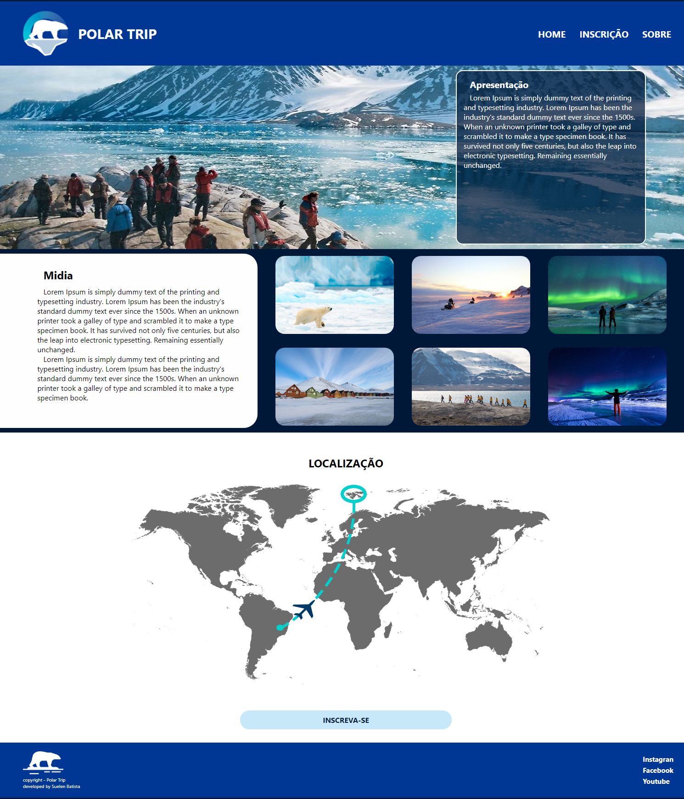
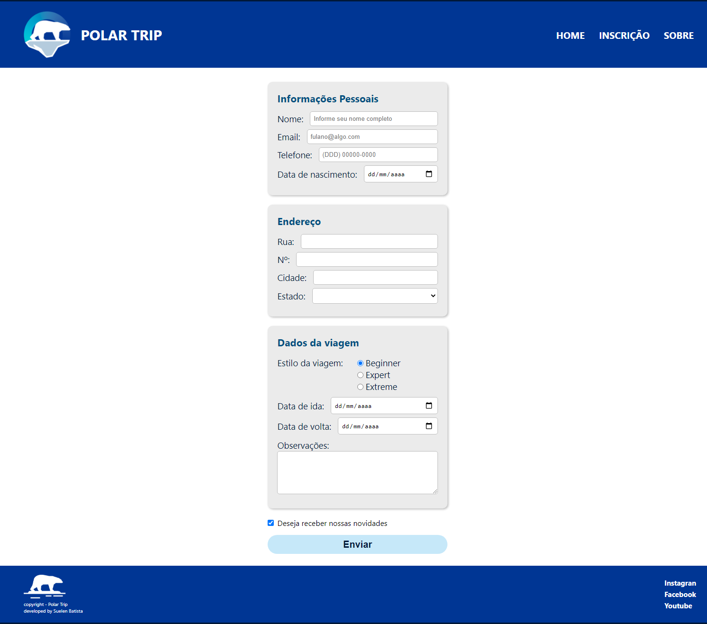
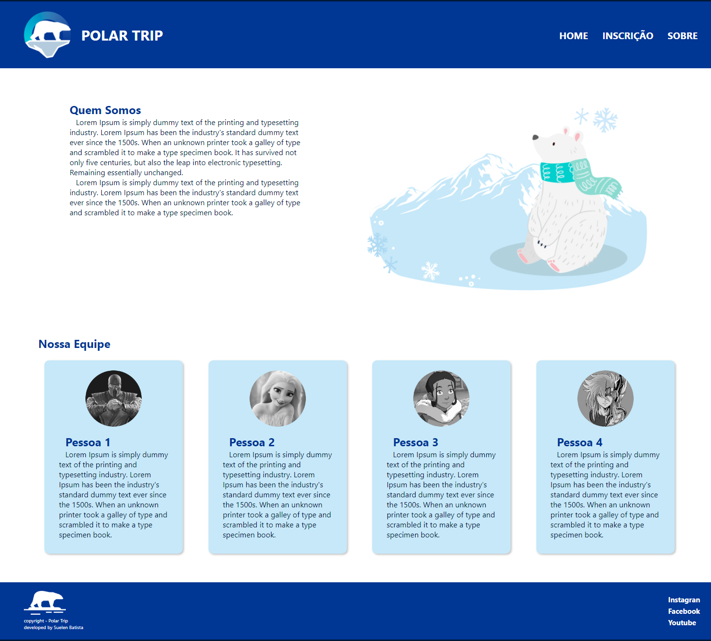
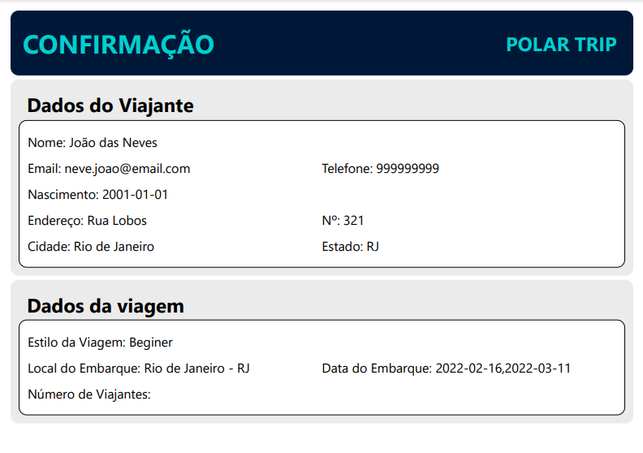
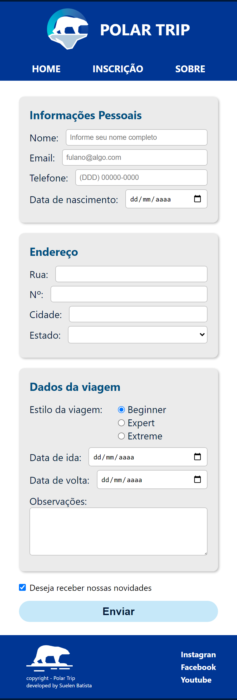
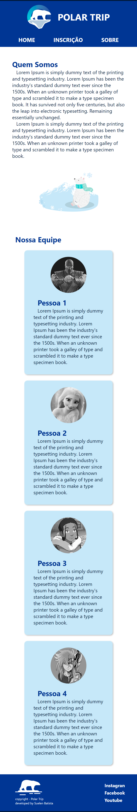

# Polar Trip - gerador de formulário
Projeto de realizado no início do curso de desenvolvimento, onde o objetivo principal era tratar formulário e gerar um retorno para o usuário.  
  
## Requerimento:
  - NodeJS

## Bibliotecas Utilizadas:
  - ejs
  - express
  - html-pdf-node
  - sass
  - nodemon (dev-dependencies)
  
  
## Primeiros Passos:
1. Faça a Instalação do NodeJS correspondente ao seu sistema operacional (caso ainda não esteja instalado). [Link de acesso a página](https://nodejs.org/en/).
2. Clone o projeto em uma pasta que deseja armazena-lo.
3. Na pasta raiz do projeto backend, instale as dependências com o comando <b>`npm install`</b> ou <b>`yarn install`</b> para instalar usando o yarn.

##
### Pagina no heroku:

[Visitar página](https://polar-trip.herokuapp.com/)

## Telas do Projeto:
#### desktop/laptop:
  - Tela Principal :
  
    
  
  - Tela do Form:
  
     
  
   - Tela de Sobre:
  
     

 #### Retorno do formulário em PDF:
  - Tela
     
     

#### desktop/laptop Demo:
  - Demo:
  
      
  
 #### Telas para mobile:
  
  - Tela Principal para mobile:
  
    
    
  - Tela do Form para mobile:
  
    
    
  - Tela de Sobre para mobile:
  
    
